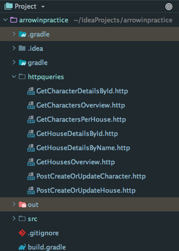
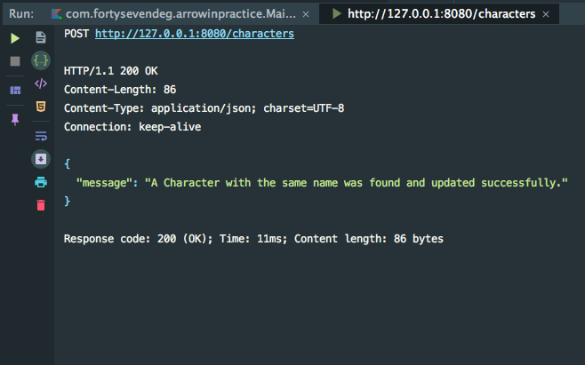

# Arrow in practice

Lambda.World Cádiz 2018 workshop hosted by [@raulraja](https://twitter.com/raulraja) and [@JorgeCastilloPR](https://twitter.com/JorgeCastilloPR).

This workshop starts with a basic **RESTful API** coded using [ktor](https://ktor.io/) ([@JetBrains](https://www.jetbrains.com/)). Our intention is to iterate over it converting it to a more functional style by putting [Arrow](https://arrow-kt.io/) into practice.

Some key points you'll learn:
* How to model your application immutable data using Arrow datatypes.
* How to operate over and transform the data using Typeclass defined behaviors.
* How to achieve polymorphism using the power of abstraction of typeclasses.
* How to use Optics to read and modify nested immutable data structures.
* How to encode sequential operations with a fancier syntax using Monad Comprehensions.
* How to encode non-dependent operations using the Applicative Builder.

# Serialization

All content negotiation (serialization / deserialization) is handled using the `Ktor` built in `Jackson` support.

# Endpoints

For detailed docs per endpoint providing `Request` and `Response` **Json** formats check the [endpoint docs](./ENDPOINTS.md).

# Testing / Running the endpoints

## Http Request Built-in support

There are `HTTP Request` files for each one of the endpoints into the `httpqueries` folder in the root directory. If you 
have IntellIJ Ultimate installed, you can run them just by using the IDE and perform a real request to the endpoint. (Don't 
forget to run the app so you get your local server deployed to localhost).

## Tests

* TBD

## Curl (Import in Postman, Paw, or use in command line)

* TBD
